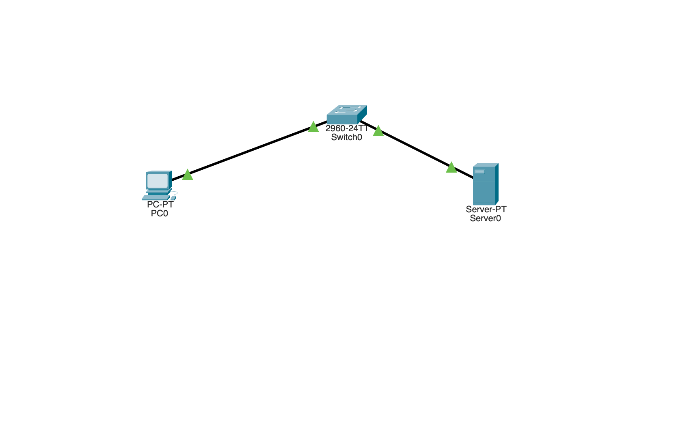
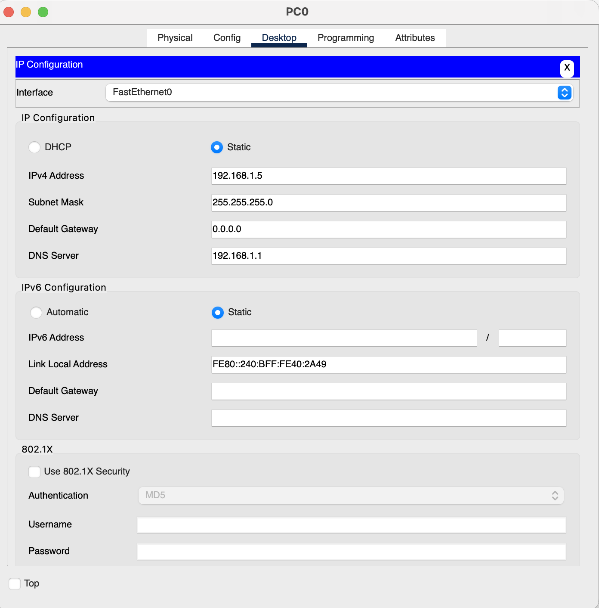
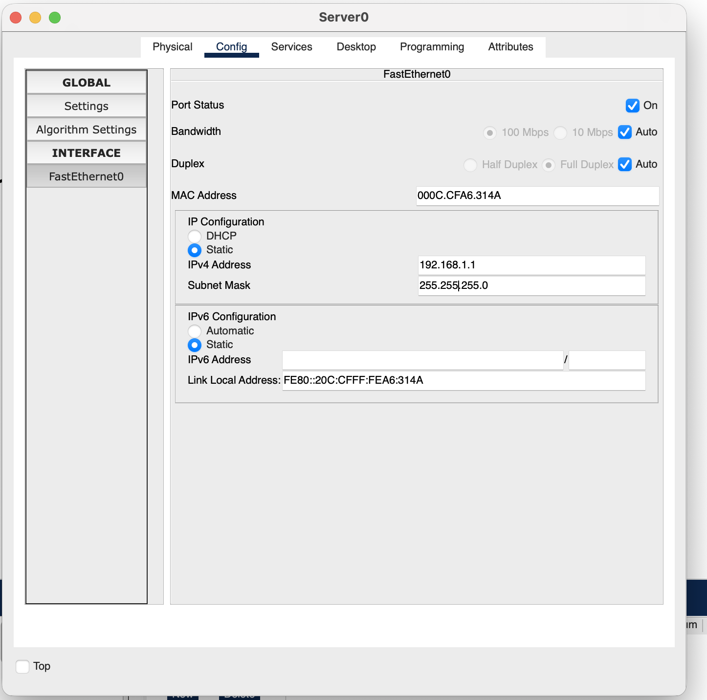
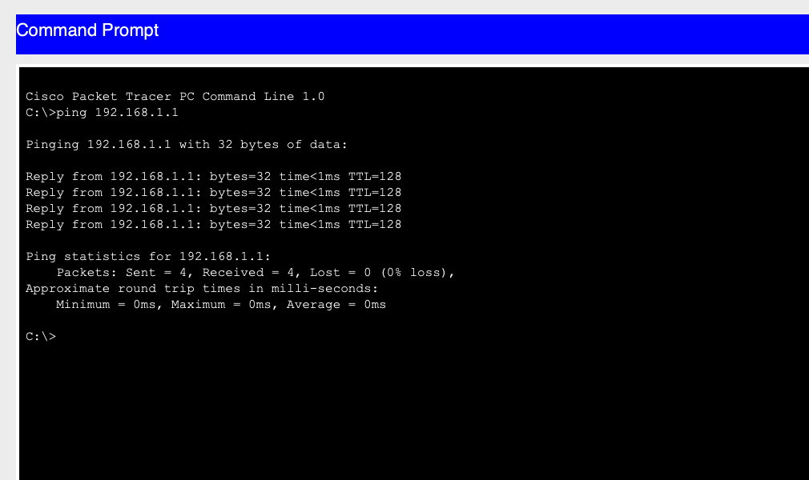
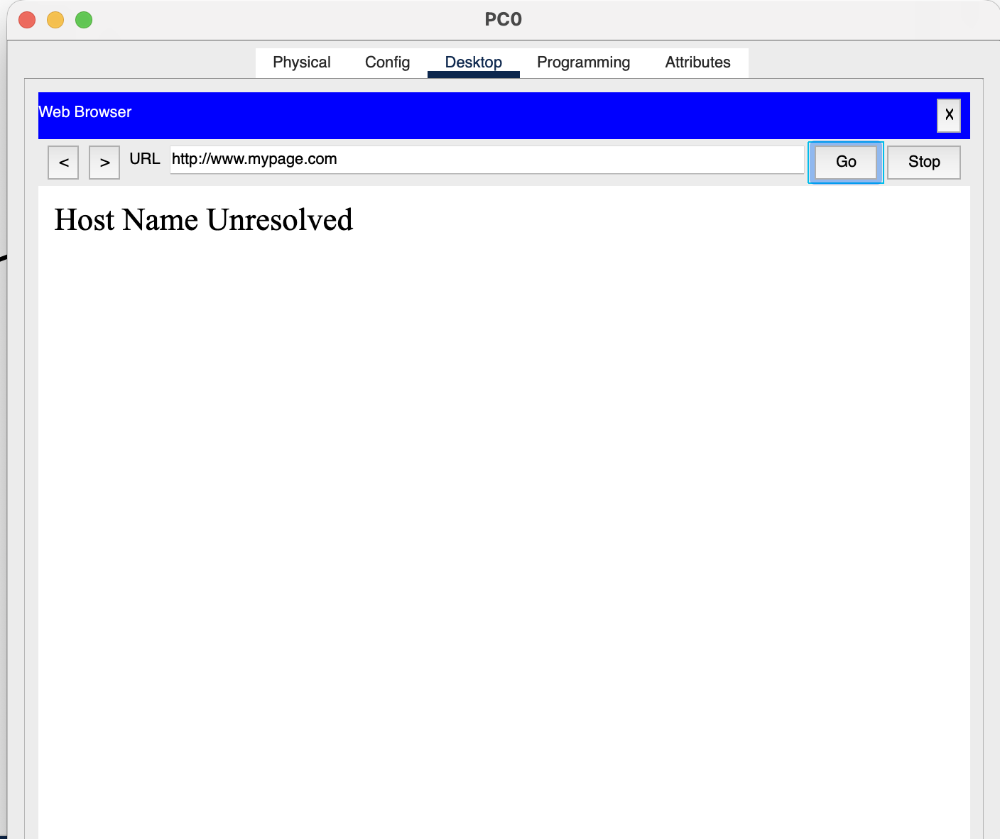
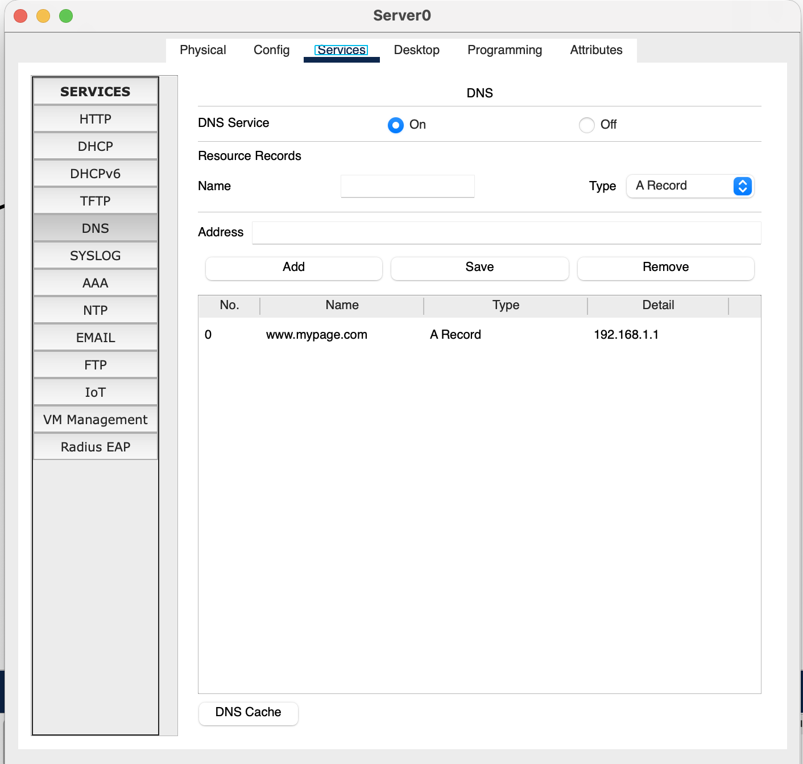

# Lab 2: DNS

## Lab Objective

The objective of this lab exercise is to learn and understand how to configure a DNS entry on a generic server and then test it from a host device.

## Lab Purpose

DNS allows you to use hostnames in the browser address bar instead of an IP address. This lab walks through setting up a DNS A record on a server and resolving it from a client PC.

## Lab Tool

Cisco Packet Tracer

## Lab Topology



PC0 and Server0 connected through a 2960-24TT switch:

```
PC0 ---- Switch0 (2960-24TT) ---- Server0
192.168.1.5              192.168.1.1
```

## Tasks

- **Task 1:** Set up the PC's IP configuration
- **Task 2:** Configure the server's IP address
- **Task 3:** Verify connectivity with a ping
- **Task 4:** Confirm the domain name fails to resolve (no DNS record yet)
- **Task 5:** Create a DNS A record on the server
- **Task 6:** Confirm the domain name resolves successfully

---

## Lab Walkthrough

### Task 1: Configure the PC's IP Address

Drag a generic host PC and a generic server onto the canvas, and connect both to a switch (any generic or Cisco switch).

On **PC0**, open the IP Configuration utility and set:

- **IPv4 Address:** `192.168.1.5`
- **Subnet Mask:** `255.255.255.0` (auto-completes)
- **DNS Server:** `192.168.1.1`



> The DNS Server field is critical here — without it, the PC has no way to know where to send name-resolution requests.

### Task 2: Configure the Server's IP Address

On **Server0**, go to **Config → FastEthernet0** and set:

- **IPv4 Address:** `192.168.1.1`
- **Subnet Mask:** `255.255.255.0`



### Task 3: Verify Connectivity

From PC0's command prompt, ping the server to confirm Layer 3 connectivity before testing DNS:

```
C:\>ping 192.168.1.1

Pinging 192.168.1.1 with 32 bytes of data:

Reply from 192.168.1.1: bytes=32 time<1ms TTL=128
Reply from 192.168.1.1: bytes=32 time<1ms TTL=128
Reply from 192.168.1.1: bytes=32 time<1ms TTL=128
Reply from 192.168.1.1: bytes=32 time<1ms TTL=128

Ping statistics for 192.168.1.1:
    Packets: Sent = 4, Received = 4, Lost = 0 (0% loss),
```



### Task 4: Test the URL Before DNS Is Configured

On PC0's web browser, try browsing to `http://www.mypage.com`. Since there is no DNS record for this name yet, the browser can't resolve it.



### Task 5: Create a DNS A Record on the Server

On Server0, go to **Services → DNS**:

1. Ensure **DNS Service** is set to **On**.
2. Under **Resource Records**, enter:
   - **Name:** `www.mypage.com`
   - **Type:** `A Record`
   - **Address:** `192.168.1.1`
3. Click **Add**.



This creates an A record mapping `www.mypage.com` to the server's own IP address (`192.168.1.1`).

### Task 6: Resolve the URL From the PC

Back on PC0's web browser, enter `http://www.mypage.com` again. This time it resolves and loads the server's default web page.


---

## Note

Remember the DNS server IP address must be set on the host (Task 1) — without it, the client has no resolver to query, and the A record on the server won't matter no matter how correctly it's configured.

## Summary

| Step | Action | Purpose |
|------|--------|---------|
| 1 | Set PC's DNS server IP | Points the client to a resolver |
| 2 | Configure server's static IP | Establishes the server as reachable |
| 3 | Ping test | Confirms IP connectivity before troubleshooting DNS |
| 4 | Browse before DNS record exists | Demonstrates "Host Name Unresolved" failure |
| 5 | Add DNS A Record | Maps a hostname to an IP address |
| 6 | Browse again | Confirms successful name resolution |

**Key takeaway:** DNS resolution requires two things to be configured correctly — the **client** must know which DNS server to query, and the **server** must have the matching resource record (A record) for the requested hostname.
