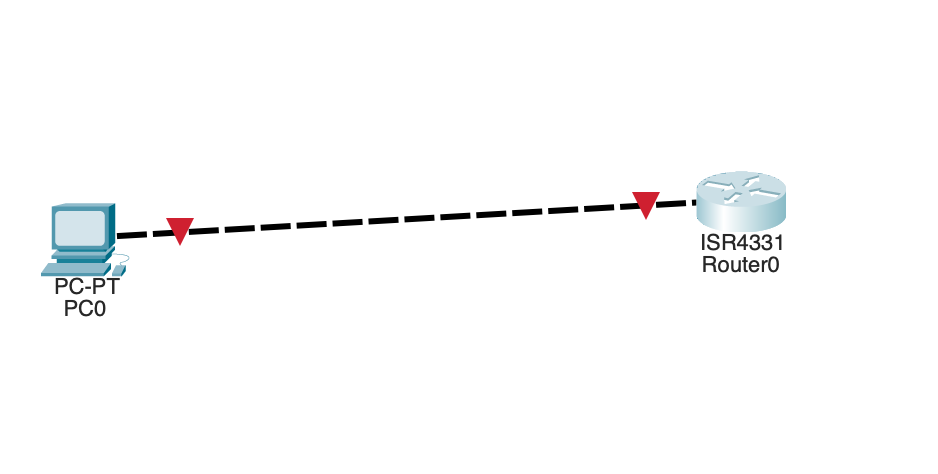
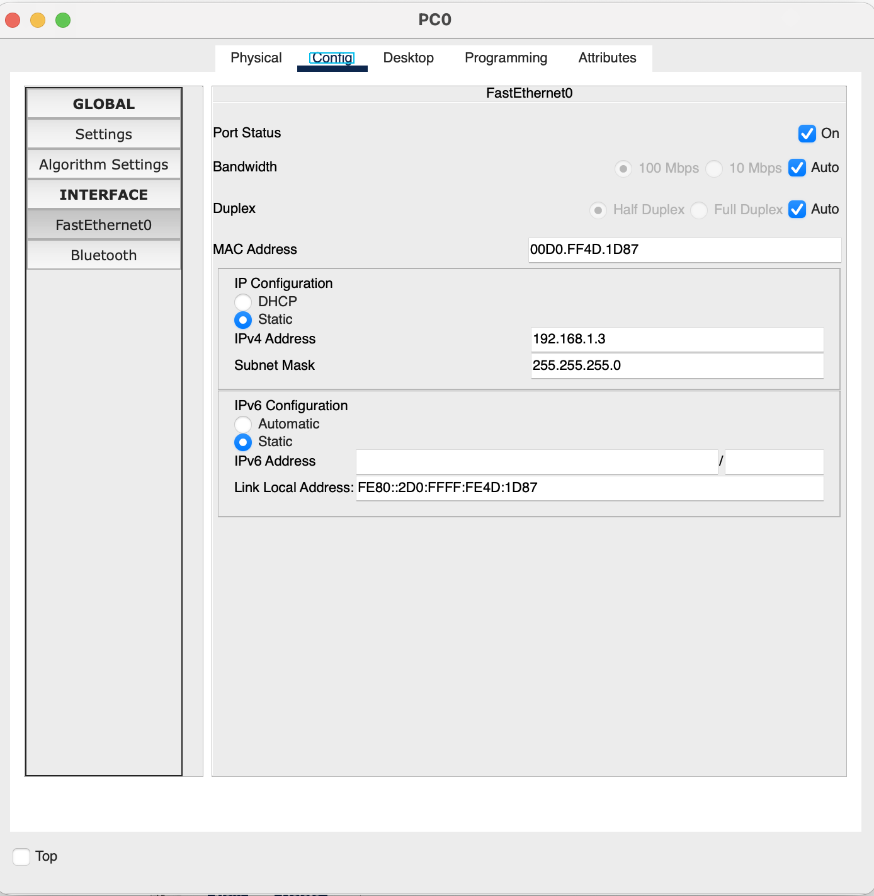
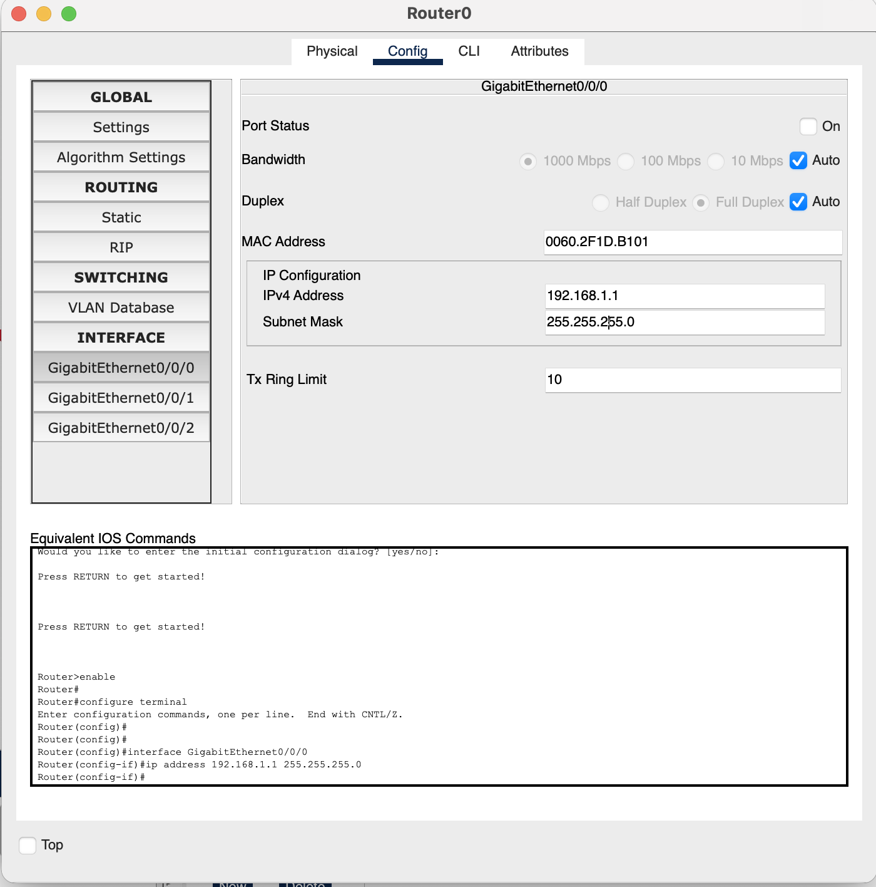
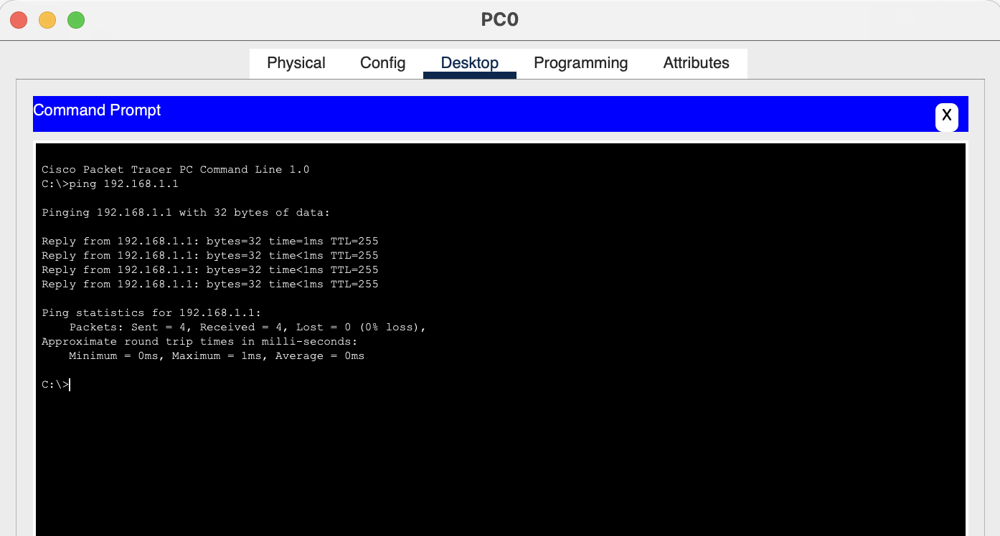
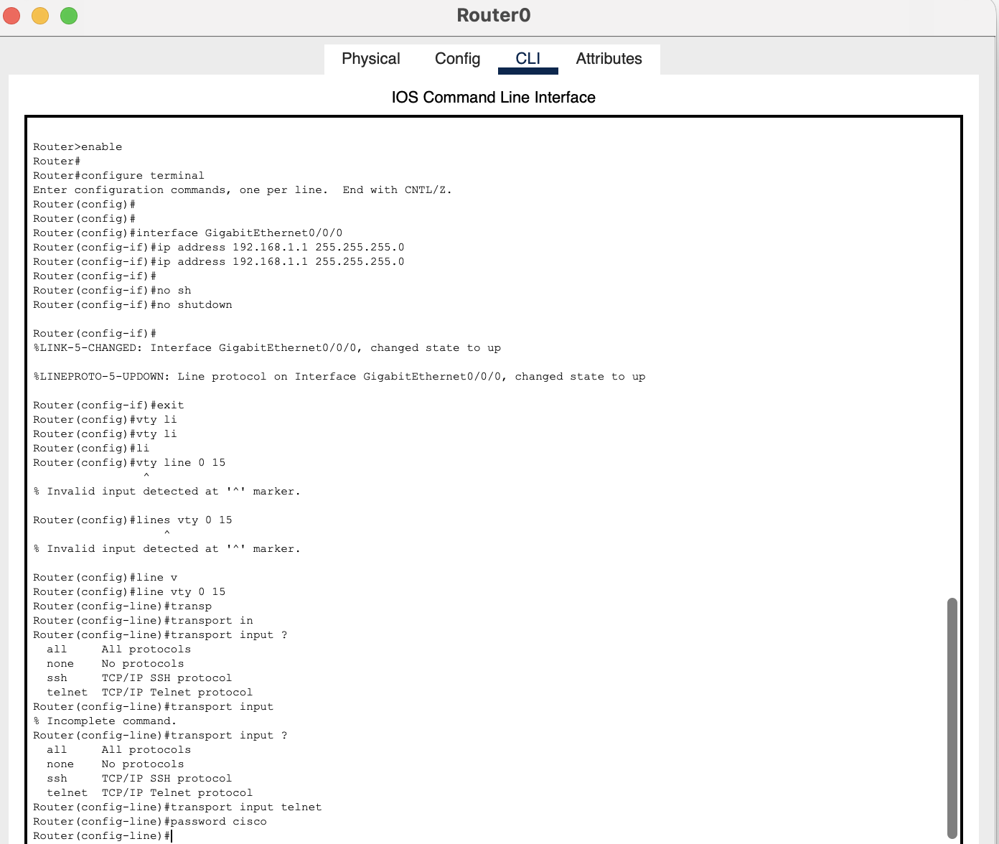
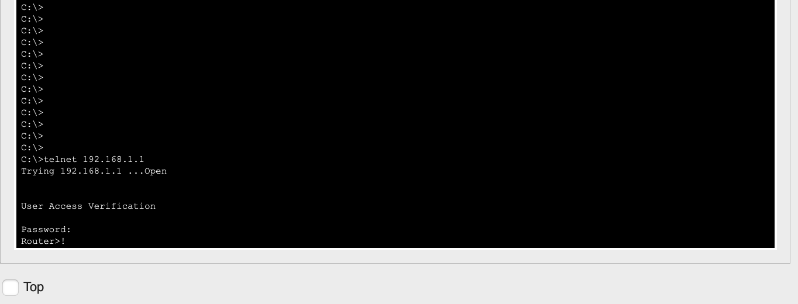

# Lab 3: Telnet

## Lab Objective

The objective of this lab exercise is to learn and understand how to enable Telnet access to a device — in this case, a Cisco router.

## Lab Purpose

Telnet is one protocol you can use to remotely connect to network devices. It's not recommended for use in commercial environments because the session information is not encrypted.

## Lab Tool

Cisco Packet Tracer

## Lab Topology



PC0 connected directly to Router0:

```
PC0 ---- Router0 (ISR4331)
              192.168.1.1
```

## Tasks

- **Task 1:** Connect the PC and router, configure IP addresses, and verify connectivity
- **Task 2:** Configure the router to permit incoming Telnet sessions
- **Task 3:** Test the Telnet connection from the PC
- **Task 4:** (Optional) View which VTY line the session was allocated to

---

## Lab Walkthrough

### Task 1: Connect and Configure IP Addressing

Connect a generic PC to a Cisco router (any model with an Ethernet interface works). Configure IP addresses on both sides.

**On PC0:**



- **IPv4 Address:** `192.168.1.3`
- **Subnet Mask:** `255.255.255.0`

**On Router0 (GigabitEthernet0/0/0):**



```
Press RETURN to get started!

Router>enable
Router#config t
Router(config)#interface g0/0
Router(config-if)#ip address 192.168.1.2 255.255.255.0
Router(config-if)#no shut
Router(config-if)#end
Router#
%SYS-5-CONFIG_I: Configured from console by console
```

Verify connectivity from the router:

```
Router#ping 192.168.1.1
Type escape sequence to abort.
Sending 5, 100-byte ICMP Echos to 192.168.1.1, timeout is 2 seconds:
.!!!!
Success rate is 80 percent (4/5), round-trip min/avg/max = 0/0/0 ms
```

And confirm from the PC's command prompt:



### Task 2: Permit Incoming Telnet Sessions

Routers use virtual terminal lines (VTY) for remote sessions — typically 16 lines, numbered 0 to 15. Configure them to accept Telnet and set a password.

```
Router#conf t
Enter configuration commands, one per line. End with CNTL/Z.
Router(config)#line vty 0 15
Router(config-line)#transport input ?
  all      All protocols
  none     No protocols
  ssh      TCP/IP SSH protocol
  telnet   TCP/IP Telnet protocol
Router(config-line)#transport input telnet
Router(config-line)#password cisco
Router(config-line)#end
```



### Task 3: Test the Telnet Connection

From the PC, Telnet to the router. You'll be prompted for the VTY password (`cisco`). There's no enable password configured, so you won't need to worry about privileged mode here.

```
C:\>telnet 192.168.1.1
Trying 192.168.1.1 ...Open

User Access Verification

Password:
Router>
```



### Task 4 (Optional): Check the VTY Line Assignment

You can see which Telnet line the incoming connection landed on with `show line`:

```
Router#show line
   Tty Line Typ     Tx/Rx   A Roty AccO AccI  Uses  Noise Overruns   Int
*     0    0 CTY              -    -    -    -      0      0     0/0     -
      1    1 AUX   9600/9600  -    -    -    -      0      0     0/0     -
*   132  132 VTY              -    -    -    -      2      0     0/0     -
    133  133 VTY              -    -    -    -      0      0     0/0     -
    134  134 VTY              -    -    -    -      0      0     0/0     -
    ...
Line(s) not in async mode -or- with no hardware support:
3-131
```

The asterisk (`*`) marks the active line — in this case line 132, one of the VTY lines.

To end the session from the PC, hold **Ctrl + Shift + 6**, release, then press **X**.

---

## Summary

| Step | Command | Purpose |
|------|---------|---------|
| 1 | `ip address` / `no shut` | Bring up connectivity between PC and router |
| 2 | `line vty 0 15` | Select all 16 virtual terminal lines |
| 2 | `transport input telnet` | Permit Telnet on those lines |
| 2 | `password cisco` | Require a password for incoming sessions |
| 3 | `telnet <ip>` | Connect remotely from the PC |
| 4 | `show line` | Confirm which VTY line handled the session |

**Key takeaway:** Telnet is functionally simple to set up but sends all traffic — including the password — in plaintext. This lab is a useful baseline before comparing it against the SSH lab, where the same VTY lines are secured with encryption instead.
