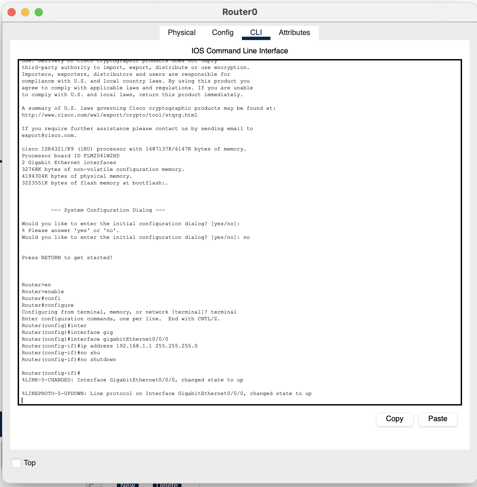
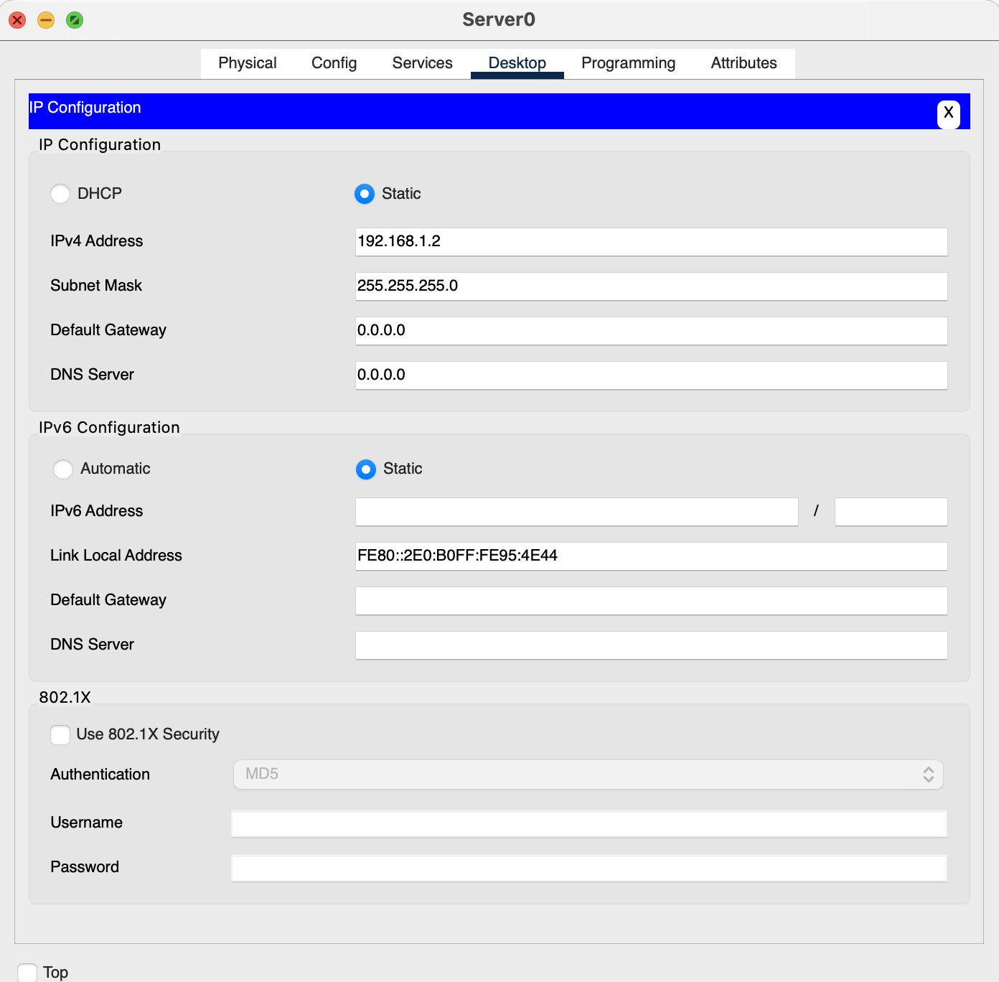
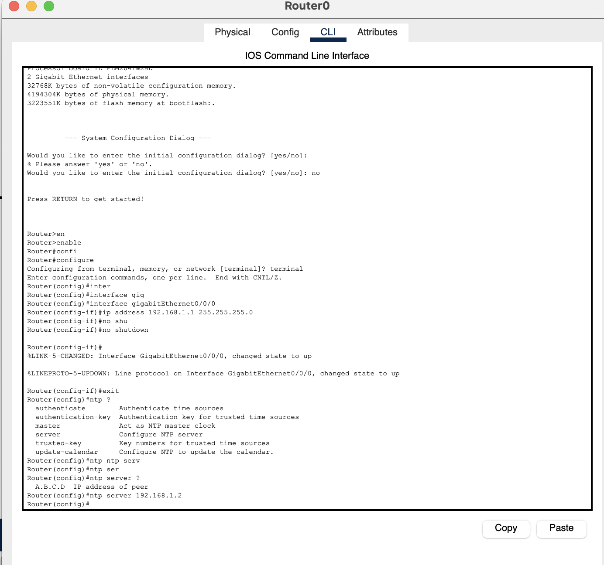
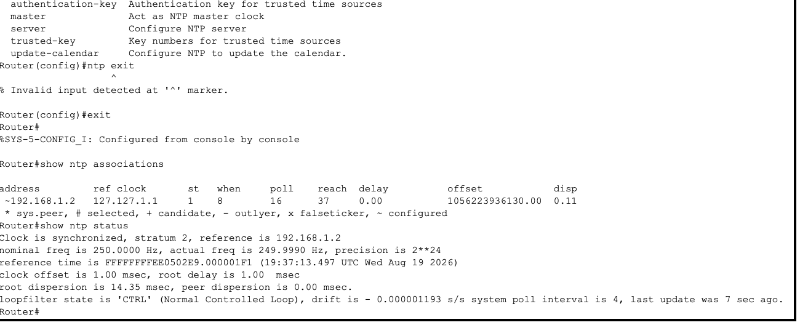

# Lab 4: Network Time Protocol (NTP)

## Lab Objective

The objective of this lab exercise is to learn and understand how to enable an NTP server and configure a device to obtain its clock time from that server. In this case, a Cisco router gets its clock from a generic server.

## Lab Purpose

NTP servers allow the internet as we know it to function. The NTP master servers receive more hits per day than Google (although, of course, all those hits are just asking "What time is it?").

> **Note:** This lab uses an 1841 model router, which boots automatically with the IOS image `flash:c1841-advipservicesk9-mz.124-15.T1.bin`. If you run into command issues, use the same model — a `show version` command will display your current IOS version. Changing the IOS version is covered in the TFTP lab.

## Lab Tool

Cisco Packet Tracer

## Lab Topology


Router0 connected directly to Server0:

```
Router0 (ISR4321) ---- Server0
   192.168.1.2         192.168.1.1
```

## Tasks

- **Task 1:** Connect the server and router, configure IPs, and verify connectivity
- **Task 2:** Check the router's default (out-of-date) clock
- **Task 3:** Configure the router to pull time from the NTP server
- **Task 4:** Enable NTP service on the server
- **Task 5:** Confirm the router's clock has synchronized

---

## Lab Walkthrough

### Task 1: Connect and Configure IP Addressing

Connect a generic server to a Cisco router using a crossover cable. Configure IP addresses on both sides and confirm connectivity.

```
Press RETURN to get started!

Router>enable
Router#config t
Router(config)#interface g0/0
Router(config-if)#ip address 192.168.1.2 255.255.255.0
Router(config-if)#no shut
Router(config-if)#end
Router#
%SYS-5-CONFIG_I: Configured from console by console
Router#ping 192.168.1.1
Type escape sequence to abort.
Sending 5, 100-byte ICMP Echos to 192.168.1.1, timeout is 2 seconds:
.!!!!
Success rate is 80 percent (4/5), round-trip min/avg/max = 0/0/0 ms
```



**Server0 IP Configuration:**



- **IPv4 Address:** `192.168.1.2`
- **Subnet Mask:** `255.255.255.0`

### Task 2: Check the Router's Default Clock

Before configuring NTP, check the router's clock — it defaults to an internal time that's badly out of date:

```
Router#show clock
*0:1:32.502 UTC Mon Mar 1 1993
```

### Task 3: Point the Router to the NTP Server

```
Router#config t
Router(config)#ntp server 192.168.1.1
Router(config)#end
Router#
```



### Task 4: Enable NTP on the Server

On Server0, enable the NTP service. It will use the host system's own clock as the time source it distributes.

### Task 5: Verify Synchronization

It can take a minute for the router's clock to update. Use the following commands to check status — note the server's IP address appearing as the NTP source:

```
Router#show ntp associations
  address         ref clock       st  when  poll  reach  delay        offset            disp
 ~192.168.1.1     127.127.1.1      1    10    16     1    1.00    803912199172.00      0.00
 * sys.peer, # selected, + candidate, - outlyer, x falseticker, ~ configured

Router#show ntp status
Clock is synchronized, stratum 16, reference is 192.168.1.1
nominal freq is 250.0000 Hz, actual freq is 249.9990 Hz, precision is 2**24
reference time is 0EE1CFA7.0000007B (1:57:59.123 UTC Thu Feb 11 2044)
clock offset is 1.00 msec, root delay is 0.00 msec
root dispersion is 14.13 msec, peer dispersion is 0.00 msec.
loopfilter state is 'CTRL' (Normal Controlled Loop), drift is - 0.000001193 s/s system poll interval is 4,
last update was 10 sec ago.

Router#show clock
13:1:39.866 UTC Tue Aug 21 2018
```



Once synchronized, the router's clock matches the server's time source instead of its stale default.

---

## Summary

| Step | Command | Purpose |
|------|---------|---------|
| 1 | `ip address` / `no shut` | Establish connectivity between router and server |
| 2 | `show clock` | Check the router's default, out-of-date time |
| 3 | `ntp server <ip>` | Point the router to the NTP source |
| 4 | Enable NTP service on server | Server becomes the time source |
| 5 | `show ntp associations` / `show ntp status` / `show clock` | Confirm synchronization succeeded |

**Key takeaway:** A router's internal clock is unreliable on its own and resets to a default value on boot. Pointing it at an NTP source keeps its clock accurate — which matters for logging, certificate validation, and troubleshooting across devices that need a consistent time reference.
