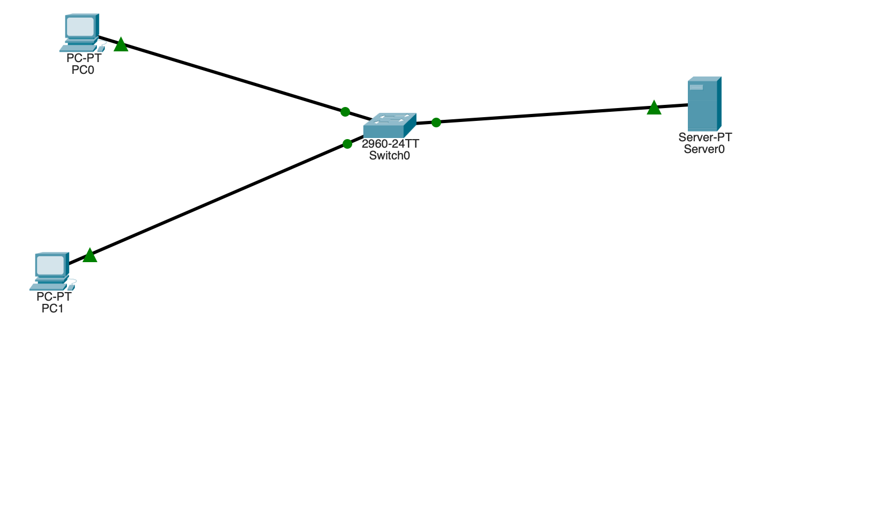
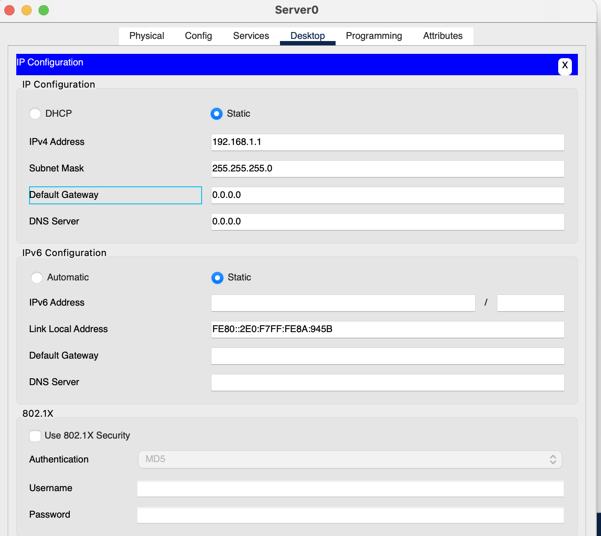
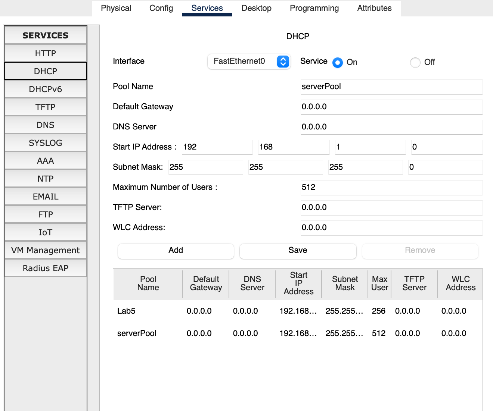
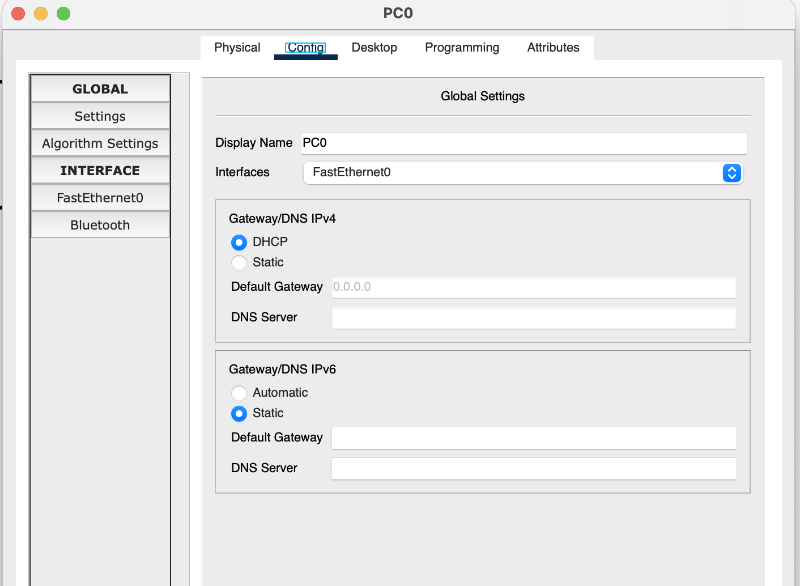
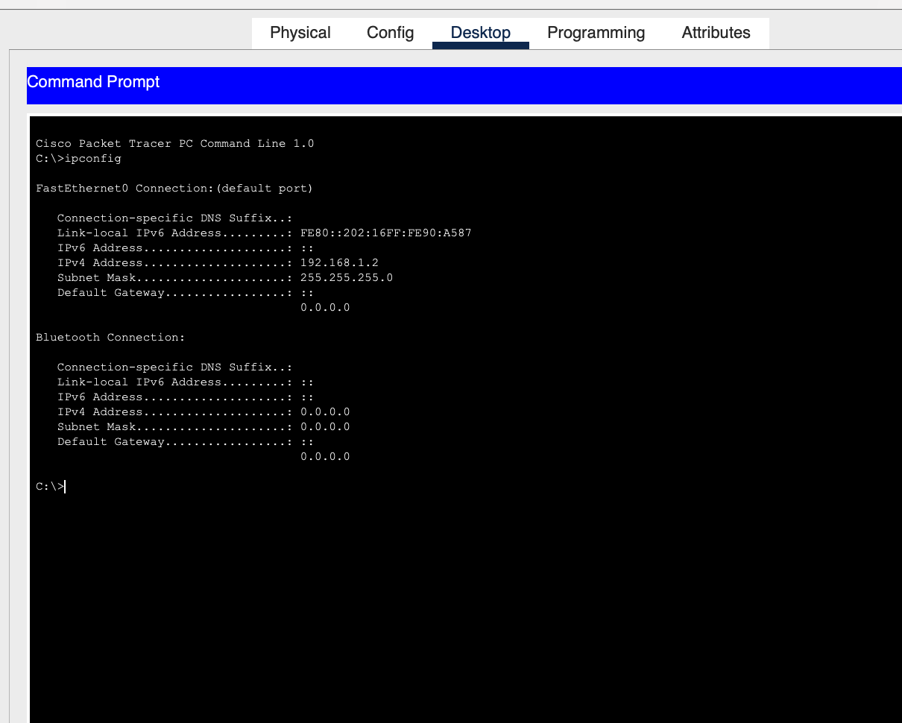
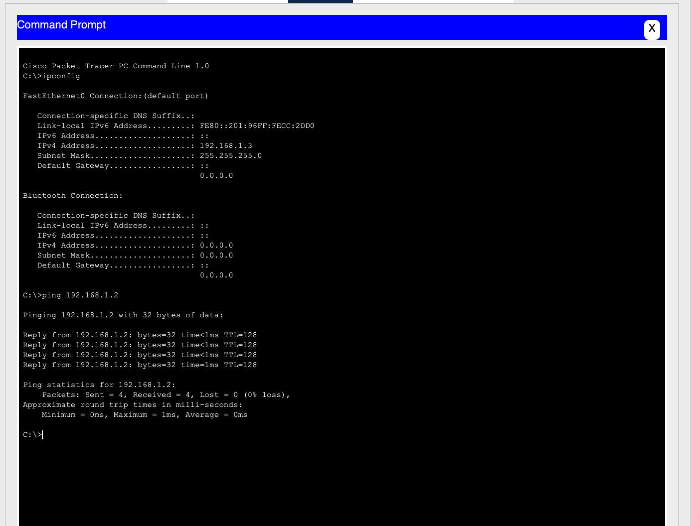

# Lab 5: DHCP

## Lab Objective

Learn how DHCP servers allocate IP information.

## Lab Purpose

The vast majority of IP networks use DHCP to allocate IP information to hosts. In this lab we configure a scope of addresses and other IP information to be allocated automatically.

## Lab Tool

Cisco Packet Tracer

## Lab Topology



Two PCs and a server connected through a 2960-24TT switch:

```
PC0 ----\
         \
          Switch0 (2960-24TT) ---- Server0
         /                          192.168.1.1
PC1 ----/
```

PC0 and PC1 obtain their IP settings via DHCP; Server0 has a static IP and runs the DHCP service.

## Tasks

- **Task 1:** Connect the server and PCs to the switch, and statically address the server
- **Task 2:** Configure the DHCP pool on the server
- **Task 3:** Set the hosts to obtain their IP settings via DHCP
- **Task 4:** Verify the DHCP-assigned configuration on the hosts
- **Task 5:** Note the DNS/gateway limitation in Packet Tracer

---

## Lab Walkthrough

### Task 1: Connect and Address the Server

Connect a generic server and two host PCs to a Cisco switch using straight-through cables. Add a static IP address to the server only — the host PCs will use DHCP.

**Server0 IP Configuration:**



- **IPv4 Address:** `192.168.1.1`
- **Subnet Mask:** `255.255.255.0`

### Task 2: Configure the DHCP Pool on the Server

On Server0, go to **Services → DHCP** and configure:

- **Pool Name:** `101Pool`
- **Default Gateway:** `0.0.0.0`
- **DNS Server:** `0.0.0.0`
- **Start IP Address:** `192.168.1.2`
- **Subnet Mask:** `255.255.255.0`
- **Maximum Number of Users:** `512`

Click **Add**, then **Save**.



### Task 3: Configure the Hosts to Use DHCP

On each PC, go to **Config → FastEthernet0** and select **DHCP** under Gateway/DNS IPv4.



### Task 4: Verify the DHCP-Assigned Configuration

Open a command prompt on each PC and run `ipconfig` to confirm the leased address.

**PC0:**

```
C:\>ipconfig

FastEthernet0 Connection:(default port)

   Connection-specific DNS Suffix..:
   Link-local IPv6 Address.........: FE80::202:16FF:FE90:A587
   IPv6 Address.....................: ::
   IPv4 Address.....................: 192.168.1.2
   Subnet Mask......................: 255.255.255.0
   Default Gateway..................: ::
                                       0.0.0.0
```



**PC1** (pinging PC0 to confirm connectivity, and its own `ipconfig` output):

```
C:\>ipconfig

FastEthernet0 Connection:(default port)

   IPv4 Address.....................: 192.168.1.3
   Subnet Mask......................: 255.255.255.0

C:\>ping 192.168.1.2

Pinging 192.168.1.2 with 32 bytes of data:

Reply from 192.168.1.2: bytes=32 time<1ms TTL=128
Reply from 192.168.1.2: bytes=32 time<1ms TTL=128
Reply from 192.168.1.2: bytes=32 time<1ms TTL=128
Reply from 192.168.1.2: bytes=32 time=1ms TTL=128

Ping statistics for 192.168.1.2:
    Packets: Sent = 4, Received = 4, Lost = 0 (0% loss),
Approximate round trip times in milli-seconds:
    Minimum = 0ms, Maximum = 1ms, Average = 0ms
```



Both PCs picked up addresses from the pool (`192.168.1.2` and `192.168.1.3`), confirming DHCP is working correctly.

> **Tip:** Hovering your mouse over any device in Packet Tracer also shows a quick summary of its current IP configuration, without needing to open a command prompt.

### Task 5: Note on DNS Server / Default Gateway

Setting a DNS server address and default gateway in the DHCP pool doesn't appear to actually get applied to the clients in Packet Tracer — both fields report `0.0.0.0` or `::` on the host side regardless of what's configured in the pool. This appears to be a simulator limitation rather than a configuration error.

---

## Summary

| Step | Action | Purpose |
|------|--------|---------|
| 1 | Static IP on server | Server needs a fixed address to act as the DHCP source |
| 2 | Configure DHCP pool | Defines the address range clients will lease from |
| 3 | Set PCs to DHCP | Clients request configuration instead of using static IPs |
| 4 | `ipconfig` on each host | Confirms the leased IP matches the configured pool |
| 5 | — | Documents a known Packet Tracer quirk with DNS/gateway options |

**Key takeaway:** DHCP centralizes IP address management — clients set to DHCP automatically pull an address from the server's pool instead of needing manual configuration, which is why almost every production network relies on it instead of static addressing.
